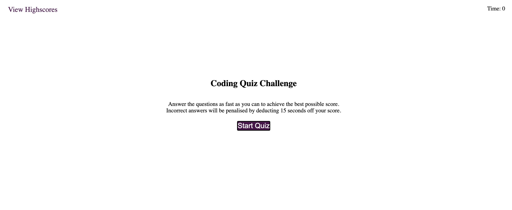

# Coding-Quiz

Task Description:
This task required me to make a quiz utilising javascript, css and HTML. The quiz would commence upon clicking the start button, and would follow with several multiple choice questions, which would update upon answering each question. The quiz is timed and an incorrect answer punishes the player by removing time from the clock. The final score of the player is the time remaining.

Task Requirements:

GIVEN I am taking a code quiz
WHEN I click the start button
THEN a timer starts and I am presented with a question
WHEN I answer a question
THEN I am presented with another question
WHEN I answer a question incorrectly
THEN time is subtracted from the clock
WHEN all questions are answered or the timer reaches 0
THEN the game is over
WHEN the game is over
THEN I can save my initials and my score

Picture of task:

URL of deployed site:
https://samuelheal.github.io/Coding-Quiz/

Thank you :)

